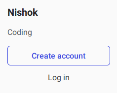
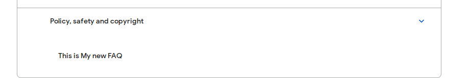
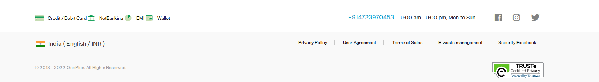
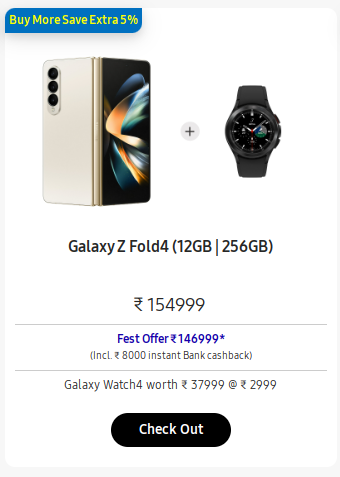
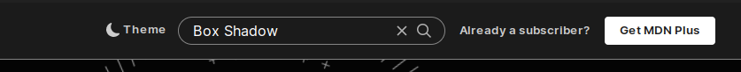
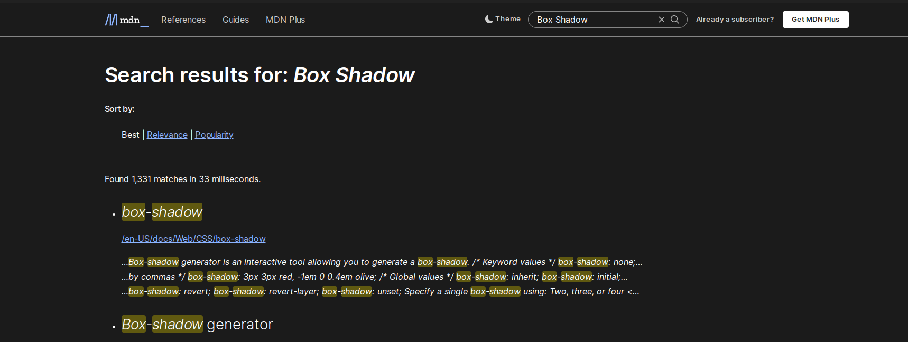

# Dom Manipulation Assignment

1. Webiste Name: [Dev To](https://dev.to/)

### Solution

> document.querySelector(".side-bar>.crayons-card>.crayons-subtitle-2").innerHTML = "Nishok";
> document.querySelector(".side-bar>.crayons-card>.color-base-70").innerHTML = "Coding";

### Output

2. Website Name: [Apple](https://support.apple.com/en-in)

### Solution

> let arr = []
> document.querySelectorAll(".as-imagegrid-item").forEach(i => {arr.push(i.innerText.replace("\nSupport", ""))})
> console.log(arr)

### Output

> ['iPhone', 'Mac', 'iPad', 'Watch', 'AirPods', 'Music', 'TV']

3. Webiste Name: [Youtube Support](https://support.google.com/youtube/)

### Solution

> let faq = document.createElement("section")
> faq.innerHTML = "<h3>This is My new FAQ</h3>"
> document.querySelector(".accordion-homepage").appendChild(faq)

### Output

4. Webiste Name: [OnePlus](https://www.oneplus.in/support)

### Solution

> document.querySelector(".service-number")
> document.querySelector(".service-number").innerText = "+914723970453"

### Output

5. Webiste Name: [Samsung](https://www.samsung.com/in/offer/online/samsung-fest/)

### Solution

> document.querySelectorAll(".diwali-deals-product-sale-btn").forEach(item => {item.innerText = "Check Out"})

### Output

6. Webiste Name: [Adidas](https://www.adidas.co.in/)

### Solution

> let searchbox = document.querySelector(".searchinput\_\_\_19uW0")
> searchbox.addEventListener("mouseover", (e)=>{e.target.style.backgroundColor = "red"})

### Output

7. Webiste Name: [MDN Web Docs](https://developer.mozilla.org/en-US/)

### Solution

> document.querySelector("#top-nav-search-input").value = "Box Shadow"
> document.querySelector("#top-nav-search-form").submit()

### Output

8. Webiste Name: [Google](https://www.google.com/)
